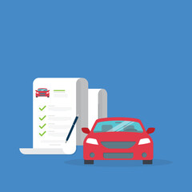

<a name="readme-top"></a>

<div align="center">
  
  <br/>
</div>

  <h3><b>VEHICLES RENTAL BACKEND</b></h3>

# 📗 Table of Contents

- [📖 About the Project](#about-project)
    - [Tech Stack](#tech-stack)
    - [Key Features](#key-features)
- [🚀 Live demo](#live-demo)
- [💻 Getting Started](#getting-started)
  - [Setup](#setup)
  - [Prerequisites](#prerequisites)
  - [Install](#install)
  - [Usage](#usage)
  - [Run tests](#run-tests)
  - [Deployment](#deployment)
  - [Kanban Board](#kanban-board)
- [👥 Authors](#authors)
- [🔭 Future Features](#future-features)
- [🤝 Contributing](#contributing)
- [⭐️ Show your support](#support)
- [🙏 Acknowledgements](#acknowledgements)
- [📝 License](#license)

# 📖 VEHICLES RENTAL - BACKEND <a name="about-project"></a>

** VEHICLES RENTAL - BACKEND ** Is a Ruby Backend project for users to rent vehicles, and Admins to create and delete vehicles. Users will have the privilege of viewing the history of vehicles reserved.

** The app frontend can be found [here](https://github.com/ONJoseph/vehicles-rental-frontend.git)

## 🛠 Built With <a name="built-with"></a>

  <ul>
    <li><a href="https://www.ruby-lang.org/en/documentation/">Ruby on Rails</a></li>
  </ul>


### Key Features <a name="key-features"></a>

- **Users can view vehicles signup, login and reserve vehicles.**
- **Admin can login, add and delete vehicles.**
- **Users can view history of vehicles**
- **Users can view characteristics of vehicles (price, electric, brand and much more).**
- **Users can view which vehicles are available for rent and which aren't**
- **Full stack app**
- **Styling uses CSS**

<p align="right">(<a href="#readme-top">back to top</a>)</p>

### Key Features <a name="key-features"></a>

## 💻 Getting Started <a name="getting-started"></a>

To get a local copy up and running, follow these steps:

### Prerequisites <a name="prerequisites"></a>

In order to run this project you need:

- [Ruby](https://www.ruby-lang.org/en/) installed and running
- [PostgreSQL](https://www.postgresql.org/) installed
- [RubyonRails](https://rubyonrails.org/) installed

### Setup <a name="setup"></a>

Clone this repository to your desired folder:

``` bash
git clone https://github.com/ONJoseph/vehicles-rental-backend.git
```
and then move to the folder: 

```bash
cd vehicles-rental-backend
```

<p align="right">(<a href="#readme-top">back to top</a>)</p>

### Install <a name="install"></a>

Install dependancies with:

```bash
bundle install
```
### Usage <a name="usage"></a>

In order to run the project please follow the next steps to create your credentials|masterkey pair:

1. Delete config/master.key and config/credentials.yml.enc if they exist.
2. Run in the terminal: `EDITOR=code rails credentials:edit`
3. This command will create a new master.key and credentials.yml.enc if they do not exist.

```console
bundle exec rails db:create
bundle exec rails db:migrate
bundle exec rails db:seed
bundle exec rails start
```
then go to [http://localhost:300](http://localhost:300)

Users to log in into the app:
```
admin: admin@admin.com
password: 123456

user: diego@gmail.com
password: 123456
```

### Run tests <a name="run-tests"></a>

To run tests, run the following command:

```sh
rspec spec/models/ // to test models
rspec spec/requests/api/v1  // to test controllers
```

### Deployment <a name="deployment"></a>

- [Watch me in action ]()

<p align="right">(<a href="#readme-top">back to top</a>)</p>

### Kanban Board <a name="kanban-board"></a>
  - Initial state of Kanban [Board](https://github.com/users/gjuliao/projects/2)
  - 
    <br/>
  - Number of team members at start and finish: 5 Team members.

<p align="right">(<a href="#readme-top">back to top</a>)</p>

## 👥 Authors <a name="authors"></a>

👤 **Joseph Ogbole**

- GitHub: [@ONJoseph](https://github.com/ONJoseph)
- Twitter: [@ONJoseph1](https://twitter.com/ONJoseph1)
- LinkedIn: [LinkedIn](https://www.linkedin.com/in/o-n-joseph-ba8425147/)

👤 **Ivan Martinez von Halle**

- GitHub: [@ivanmvh](https://github.com/ivanmvh)
- LinkedIn: [Ivan Martinez von Halle](https://www.linkedin.com/in/ivan-martinez-von-halle/)

👤 **Diego Cuenca**

- GitHub: [@dcuenca](https://github.com/dcuenca)

<p align="right">(<a href="#readme-top">back to top</a>)</p>

## 🔭 Future Features <a name="future-features"></a>

- **Add price to reservation**
- **Add plac-id to vehicles**

<p align="right">(<a href="#readme-top">back to top</a>)</p>

## 🤝 Contributing <a name="contributing"></a>

Contributions, issues, and feature requests are welcome!

Feel free to check the [issues page](https://github.com/ONJoseph/vehicles-rental-backend/issues).

<p align="right">(<a href="#readme-top">back to top</a>)</p>

## ⭐️ Show your support <a name="support"></a>

If you like this project please give it a star.

<p align="right">(<a href="#readme-top">back to top</a>)</p>

## 🙏 Acknowledgments <a name="acknowledgements"></a>

- [Microverse Team and classmates](https://www.microverse.org/).

<p align="right">(<a href="#readme-top">back to top</a>)</p>

## ❓ FAQ <a name="faq"></a>

- **Can I use this project for personal use?**

  - Sure, if you want to talk about something specific, feel free to send me a direct message. <br><br>
 
<p align="right">(<a href="#readme-top">back to top</a>)</p>

## 📝 License <a name="license"></a>

This project is [MIT](./LICENSE) licensed.

<p align="right">(<a href="#readme-top">back to top</a>)</p>